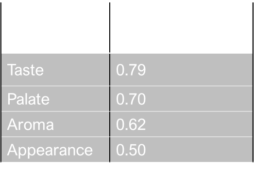

Andrew Graham
February 3, 2023

**Beer Preference Trends: Recommendations and Analysis**

**Purpose**

The purpose of this project is to analyze and develop recommendation
models for beer preferences from data obtained through scraping
BeerAdvocates.com. The goal is to determine the feasibility of providing
insightful beer recommendations to users based on both content-based and
collaborative filtering models. The data collected will be used to
analyze beer preferences and to generate accurate and relevant beer
recommendations.

**Significance**

The development of a recommendation model for beer preferences can
greatly benefit the beer industry by providing personalized
recommendations to consumers based on their individual tastes and
preferences. This can lead to increased sales, higher levels of customer
satisfaction, allowing for a competitive advantage to companies that use
those systems.

**Research Question**

What is the effectiveness of collaborative and content-based
recommendation models in predicting beer preferences?

**Data Description**

The dataset is the result of scrapping the website BeeAdvocates.com for
user reviews on various beers. The data includes simple beer
descriptions and the ratings each beer received. The original data set
contains 1,586,251 datapoints, each a single review. The data has 7
continuous feature and 6 nominals. All 6 nominal features are
categorical.

> **Data Preprocessing**

**Data Preparation**

The analysis of the dataset revealed the presence of null values in the
features brewery_name, review_profilename, and beer_abv. The null values
in brewery_name and review_profilename, which were less than 400, were
removed. The 67,785 null values in beer_abv were imputed using the mean
beer_abv of the beer style, as alcohol content is typically related to
beer styles. The mismatch in the count of brewery names and brewery ids,
with a higher count of ids, was due to multiple locations of the same
brewery. This issue was resolved by collecting the location of each
brewery through web scraping and attaching it to the dataset. The same
solution was applied to the individual beers.

**Exploratory Data Analysis**

***Continuous***

The 7 continuous features consist of the review scores and the beer abv.
The beer abv represents the alcohol content level which is measured by
percentage. The scores are split into an overall score and individual
scores for aroma, appearance, palate, and taste. These are subjective
ratings of the beers on a scale of 1-5. The overall score is a sperate
score from the individual scores and there is not a direct formulaic
connection between them. The date feature is a DateTime code that ranges
from 1996-2012.

**Nominal**

The nominal features consist of the profile name of each reviewer, the
name and id of each beer, and the name and id of each brewery. Both id's
relate to the id on the BeerAdvocates site. Finally, the is beer style
which categorizes each beer into different styles such as IPA, Ale, etc.
In the dataset, there are 5838 unique brewery IDs and 5742 unique
brewery names, 33387 unique reviewers, 104 unique beer styles, 66040
unique beer IDs and 56847 unique beer names. When grouped by reviewer,
the data is rather sparse with 33% of reviewers rating only beer, and
66% rating \<10

***Overall Score and Individual Scores***

All scores are fairly normally distributed around the score of 4
indicating a bias of users reviewing mostly beers they liked versus ones
they did not. All are on the 0-5 scale with the exceptions of Aroma,
Taste, and Palate, which were 1-5

In determining the relation between the individual and overall scores, a
correlation analysis was done. The Pearson Correlation showed that Taste
and Palate have the most impact followed by Aroma then Appearance. The
Spearman Correlation was also used and produced similar results.

***Aggregating Reviews***

When aggregating ratings for evaluation based on beers, styles, or any
other group, it is important to consider both the proportion of positive
ratings and the uncertainty associated with a small number of
observations. To address this challenge, the Wilson Score Confidence
Interval \[1\] will be applied to provide more reliable scores that
consider the number of reviews. The Wilson Score Confidence Interval
provides a balance between the proportion of positive ratings and the
uncertainty of a small number of observations. In this context, scores
equal to or greater than 3 are considered positive.

***Grouping Reviews***

When grouping the reviews by beers. One interesting result is the number
of reviews a beer had correlated with the overall score (and thus the
individual scores as well). This would make sense as Beer Advocates is
an enthusiast site and people are more like to rate beers they like
versus ones the don't.

**Clustering**

In order to help with the content-based recommendation systems, a
cluster analysis was performed to determine if there were groups that
could aid in differentiating the beers. Firstly, we took the data on the
overall score and number of reviews (using the square root of the
overall score). The data was scaled using the StandardScaler function
from scikit-learn to normalize the data in the data frame. This was done
since the two features had widely different scales while MinMaxScaler
would have led to data bias. Finally, an elbow plot was used to
determine the optimal k number to be used in the K-means algorithm.

From this plot a k number of 4 was used. As seen in the charts below 4
groups were found. Group 0: Low score, Low reviews, Group 1: Mid Score,
Low Reviews, Group 2: High Score, High Reviews, Group 3: High Reviews

From this we can use groups 2 and 3 as representative of more well-known
beers and less well known beers in recommendation systems.

**Recommendation Models**

**Content Based Recommendations**

If we do not know anything about how the user rates certain beers, we
can use a recommendation model that is a content-based filtering model,
which makes recommendations based on the characteristics of the beers
the user has liked in the past. In this case, the model created is
making recommendations for beers to try based on the user\'s preference
for IPAs.

For this we use the dataset grouped by beers with the overall scores
aggregated by the Lower bound of Wilson score confidence interval as
described earlier. From this, the first step in the model is to select
all the beers in the data that belong to the IPA style. Since there are
multiple types of IPAs, and style with the text IPA will be filtered.

Next, the selected beers are sorted based on the \'review_overall\'
column, which represents the average overall review rating of each beer.
Finally, the top 3 beers with the highest \'review_overall\' values are
selected from the highly reviewed group and the lower number of review
group. So that the user can choose from more well known and less well
known beers.

**Collaborative Filtering Model**

Since the dataset is of user reviews, a collaborative filtering model,
which makes recommendations based on the preferences of similar users,
was developed. In this case, the model is making recommendations for
beers that users who enjoy a specific type of beer might also like. For
this case the individual beer used was Shiner Bock. The first step in
the model is to select all users who have rated Shiner Bock with a score
of 4 or higher. This score was chosen as it represents those who greatly
enjoyed the beer. The reviews are then filtered to only include reviews
from these users. The final step in the model is to group the filtered
reviews, aggregate the overall scores, and sort in descending order
based on the overall review score, and the top beers from this list are
selected as recommendations.

This model makes recommendations based on the preferences of similar
users and is useful for making personalized recommendations when the
user\'s preferences are not well understood. If a user likes Shiner
Bock, they may also like:

**ALS Recommendation System**

When considering the large amount of data (over 1.5 million reviews) and
the fact that approximately 33% of reviewers left only 1 review, this
represents a high level of sparsity and presents challenges in the
traditional recommendation models in recommendation accuracy. A
collaborative ALS model was chosen due to its ability to handle sparse
data effectively and the ability to scale to large-scale datasets with
implicit feedback.

We construct the Collaborative ALS Model using PySpark to be compatible
with distributed computing. This model uses a review dataset consisting
of three columns: username, beer, and overall score. To reduce the
sparsity of the data, we filter out users and beers with less than 10
reviews. Due to computational limitations hyperparameters were unable to
be tuned at this time.

The analysis revealed a Root Mean Squared Error (RMSE) of 0.6 in the ALS
recommendation model. This when considering a rating scale of 0 to 5,
shows an average deviation of approximately 0.6 between the predicted
ratings and the actual ratings. This result suggests that the model\'s
predictions are not highly accurate with a relatively large average
deviation compared to the rating scale.

> **Conclusion**

The objective of this study was to create a recommendation system for
recommend beers to users. The resulting models are simplistic, and the
ALS model left a relatively large error rate, so there is much room for
improvement. To achieve this, there a few steps we could take. First,
update our data by conducting a web scraping operation for more recent
information Second we can integrate beer profile data if it is
available, thereby increasing the robustness of the content-based
recommendation systems. To further enhance the accuracy of our ALS
model, additional computing power can be used to fine tune the ALS
hyperparameters. A distributed network will need to be used. Finally we
can implement a hybrid model that combines both content-based and
collaborative filtering models. This new hybrid model can then allow the
development of an application that will allow users to access these
recommendations with ease.

**References**

1.  Miller, Evan. "How Not to Sort by Average Rating." *EvanMiller.org*,
    Evan Miller, 9 Feb. 2009,
    https://www.evanmiller.org/how-not-to-sort-by-average-rating.html.

‌
